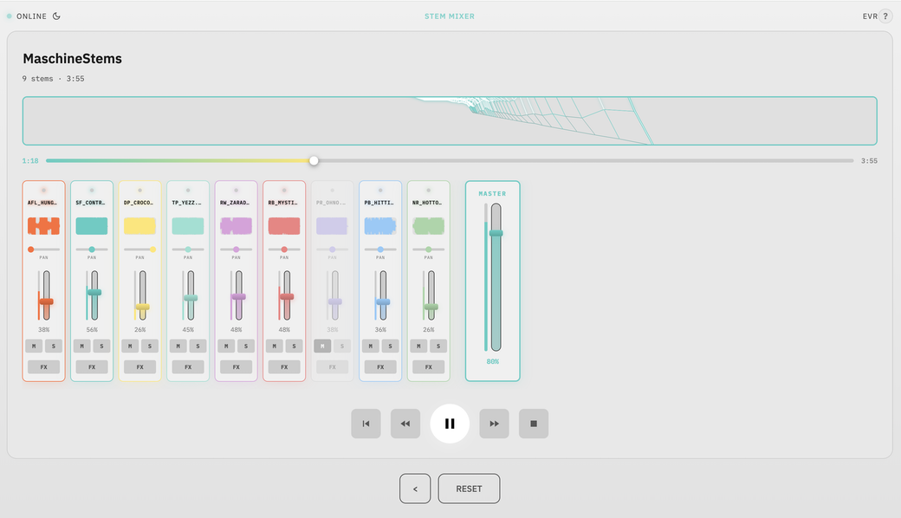

# 🎚️ Everything is Remixed

[](http://creativecommons.org/publicdomain/zero/1.0/)
[](https://mixer.ichbinsoftware.com)
[](https://evr.ichbinsoftware.com/)

<div align="center">
  
</div>

<br/>

A web-based stem mixer for the [Everything is Free](https://github.com/ichbinsoftware/everythingisfree) album by Software-Entwicklungskit. Remix tracks by manipulating individual audio stems directly in the browser.

All stems, artwork, and code are **public domain** (CC0 1.0).

> *"The mixer is not a playback device. It's a creative tool."*

<div align="center">

**[🎛️ Album Mixer](https://evr.ichbinsoftware.com)** · **[🎚️ Standalone Mixer](https://mixer.ichbinsoftware.com)**

</div>

---

## Features

- **Real-time mixing** — Volume, pan, mute, solo per stem
- **Effects chain** — 3-band EQ, highpass/lowpass filter, reverb, delay
- **Shareable URLs** — Every mix state encoded in the URL
- **3D visualizer** — Holographic frequency display
- **Responsive** — Desktop and mobile support
- **Themes** — Light and dark mode

---

## How It Works

### Architecture

```
┌─────────────────────────────────────────────────────────────────┐
│                        Cloudflare Edge                          │
├─────────────────────────────────────────────────────────────────┤
│  Workers        │  R2 Buckets (per track)  │  Workers Assets    │
│  (routing)      │  hydrogen-stems/         │  (JS/CSS/JSON)     │
│                 │  lithium-stems/          │                    │
│                 │  sodium-stems/           │                    │
│                 │  ...                     │                    │
└─────────────────────────────────────────────────────────────────┘
                              │
                              ▼
┌─────────────────────────────────────────────────────────────────┐
│                         Browser                                  │
├─────────────────────────────────────────────────────────────────┤
│  Web Audio API          │  Canvas/OffscreenCanvas  │  ES6       │
│  (mixing, effects)      │  (waveforms, visualizer) │  Modules   │
└─────────────────────────────────────────────────────────────────┘
```

### Audio Signal Chain

Each stem passes through a complete effects chain before reaching the master output:

```
┌──────────┐   ┌─────────┐   ┌──────────┐   ┌───────┐   ┌────────┐   ┌──────┐
│  Source  │ → │   EQ    │ → │  Filter  │ → │ Delay │ → │ Panner │ → │ Gain │
│ (M4A)    │   │ (3-band)│   │ (LP/HP)  │   │       │   │        │   │      │
└──────────┘   └─────────┘   └──────────┘   └───────┘   └────────┘   └──────┘
                                                                          │
                              ┌─────────────────────────────────────────────┘
                              │
                              ▼
                        ┌───────────┐   ┌─────────────┐   ┌─────────────┐
                        │  Master   │ → │   Reverb    │ → │ Destination │
                        │   Gain    │   │ (Convolver) │   │  (Output)   │
                        └───────────┘   └─────────────┘   └─────────────┘
```

### URL State Encoding

Mix states are shareable via URL parameters:

```
?mix=0:80:0:0:0,1:100:1:0:0,2:60:0:1:5&master=75
      │  │  │ │ │
      │  │  │ │ └─ pan (-10 to 10)
      │  │  │ └─── solo (0/1)
      │  │  └───── mute (0/1)
      │  └──────── volume (0-100)
      └─────────── stem index
```

---

## 🎵 Tracks

7 tracks, 148 stems total. Named after alkali metals.

| # | Track | Symbol | BPM | Key | Stems | Link |
|:--|:------|:------:|:---:|:---:|:-----:|:-----|
| 1 | Hydrogen |  | 132 | D Major | 12 | [Mix →](https://evr.ichbinsoftware.com/hydrogen) |
| 2 | Lithium |  | 124 | G minor | 38 | [Mix →](https://evr.ichbinsoftware.com/lithium) |
| 3 | Sodium |  | 140 | G minor | 28 | [Mix →](https://evr.ichbinsoftware.com/sodium) |
| 4 | Potassium |  | 90 | C Major | 19 | [Mix →](https://evr.ichbinsoftware.com/potassium) |
| 5 | Rubidium |  | 132 | G Major | 9 | [Mix →](https://evr.ichbinsoftware.com/rubidium) |
| 6 | Caesium |  | 130 | C Major | 16 | [Mix →](https://evr.ichbinsoftware.com/caesium) |
| 7 | Francium |  | 128 | B♭ Major | 26 | [Mix →](https://evr.ichbinsoftware.com/francium) |

---

## 🎛️ Standalone Mixer

<div align="center">
  
</div>

<br/>

**[mixer.ichbinsoftware.com](https://mixer.ichbinsoftware.com)**

A self-contained mixer for your own audio files. No server required — runs entirely in the browser.

- Drop or upload any audio files (M4A, MP3, MP4, WAV, FLAC, OGG)
- Same effects chain and visualizer as the album mixer
- Works offline once loaded

---

## 🎨 Artwork

Digital artwork by **Maubere**.

---

## Documentation

Technical documentation in [`docs/`](docs/):

| Document | Description |
|:---------|:------------|
| [ARCHITECTURE.md](docs/ARCHITECTURE.md) | System design, modules, signal chain |
| [CLIENT_APP.md](docs/CLIENT_APP.md) | Audio engine, state management, UI |
| [SERVER_WORKER.md](docs/SERVER_WORKER.md) | Cloudflare Workers, R2, routing |
| [MIXER_SYSTEM.md](docs/MIXER_SYSTEM.md) | Effects reference, URL encoding |
| [PERFORMANCE.md](docs/PERFORMANCE.md) | Optimizations, animation loop |

---

## Contributing

Contributions welcome.

1. Fork the repository
2. Create a feature branch (`git checkout -b feature/name`)
3. Commit changes (`git commit -m 'Add feature'`)
4. Push (`git push origin feature/name`)
5. Open a Pull Request

---

## Credits

- **Music & Production:** Software-Entwicklungskit · [@ichbinsoftware](https://www.instagram.com/ichbinsoftware/)
- **Artwork:** Maubere

---

## License

**CC0 1.0 Universal** — Public Domain

You may copy, modify, distribute, remix, and commercialize this work without permission, credit, or restriction.

---

## Related

- [ichbinsoftware/everythingisfree](https://github.com/ichbinsoftware/everythingisfree) — Album stems, artwork, npm package
- [MANIFESTO.md](MANIFESTO.md) — Philosophy behind public domain release
