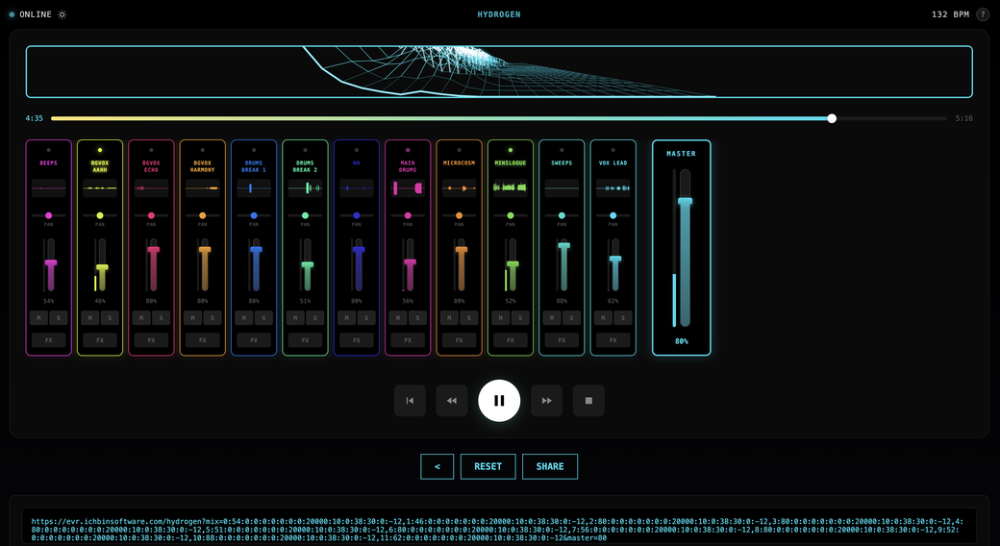
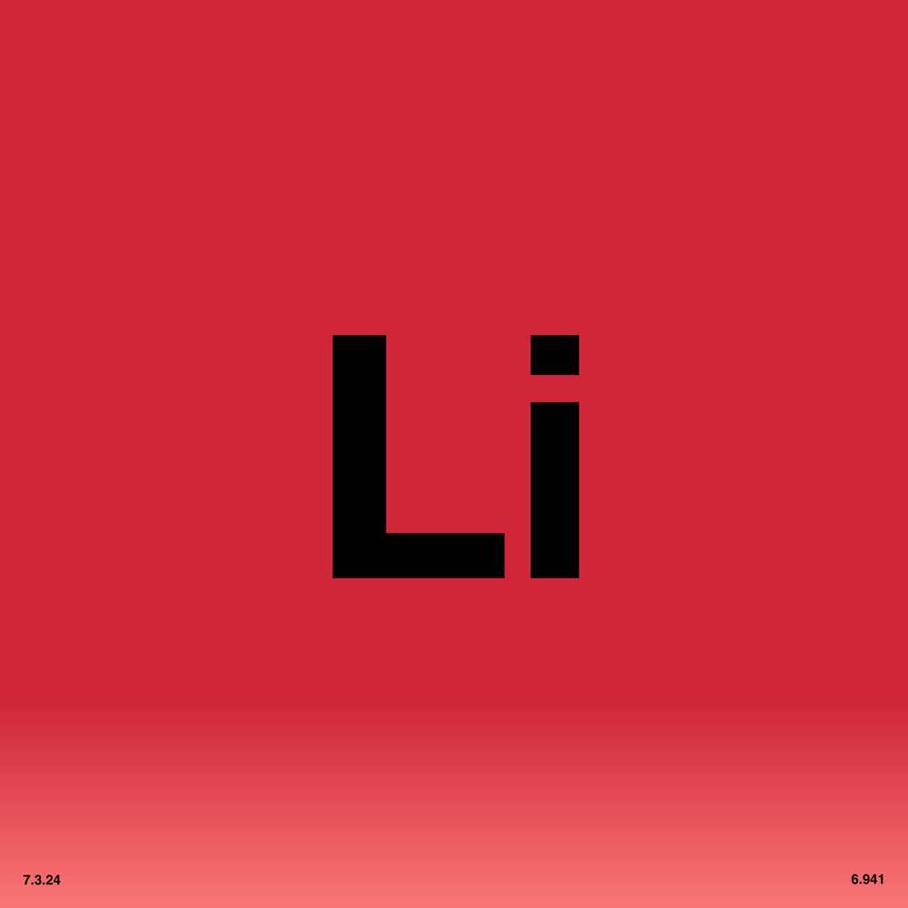
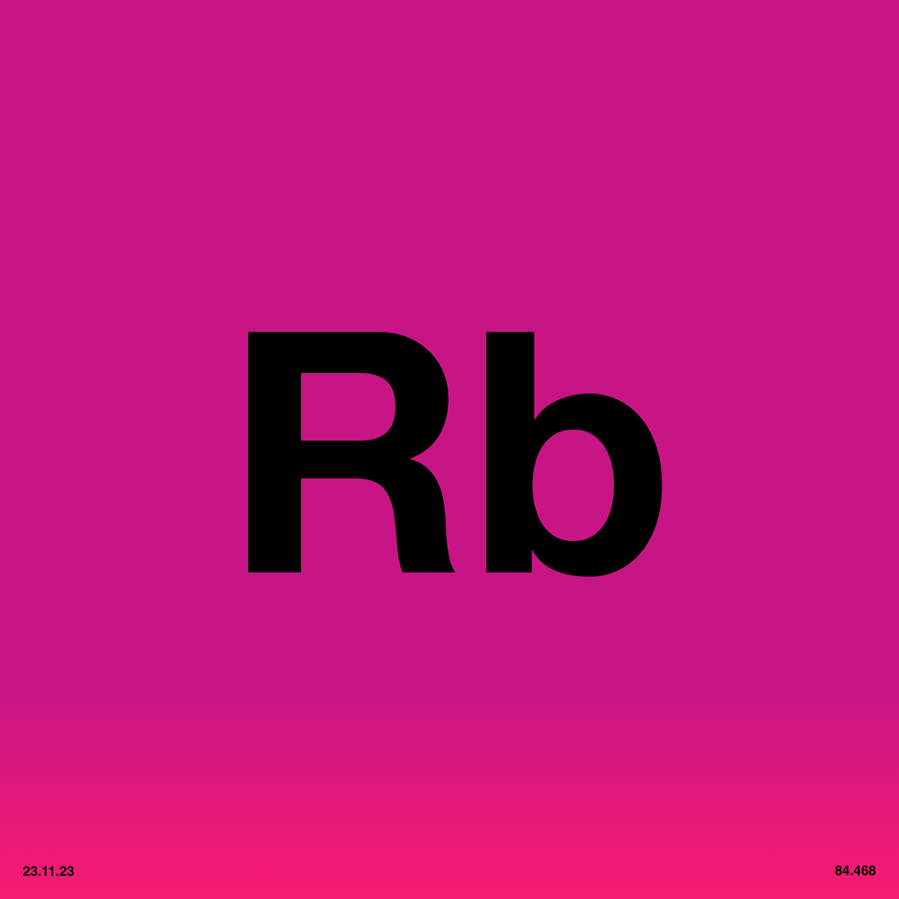

# 🎚️ Everything is Remixed

  
   

  

Interactive stem mixer for the [Everything is Free](https://github.com/ichbinsoftware/everythingisfree) album by Software-Entwicklungskit.

All audio stems, artwork, code, artifacts and information in this repository are released under **Creative Commons Zero v1.0 Universal (CC0 1.0)**.

> **"The mixer is not a playback device. It's a creative tool."**
>
> **"Music should circulate like electricity."**
>
> **"This work is not a product. It is not content. It is not owned."**

## About

A browser-based mixing console for the 7 tracks and 148 stems of "Everything is Free." Built with Web Audio API.

**Features:**
- Real-time mixing with volume, pan, mute, and solo
- Per-stem effects: 3-band EQ, filter, reverb, delay
- Shareable mix URLs
- 3D holographic visualizer
- Light/dark theme
- Mobile support

## 🎵 Tracks

| # | Track | Symbol | BPM | Key | Stems | Link |
|:---|:---|:---:|:---:|:---:|:---:|:---|
| 1 | Hydrogen |  | 132 | D Major | 12 | [Mix](https://evr.ichbinsoftware.com/hydrogen) |
| 2 | Lithium |  | 124 | G minor | 38 | [Mix](https://evr.ichbinsoftware.com/lithium) |
| 3 | Sodium |  | 140 | G minor | 28 | [Mix](https://evr.ichbinsoftware.com/sodium) |
| 4 | Potassium |  | 90 | C Major | 19 | [Mix](https://evr.ichbinsoftware.com/potassium) |
| 5 | Rubidium |  | 132 | G Major | 9 | [Mix](https://evr.ichbinsoftware.com/rubidium)  |
| 6 | Caesium |  | 130 | C Major | 16 | [Mix](https://evr.ichbinsoftware.com/caesium) |
| 7 | Francium |  | 128 | B flat | 26 | [Mix](https://evr.ichbinsoftware.com/francium) |

## 🎨 Artwork

Digital artwork by **Maubere**.

## Related

- [ichbinsoftware/everythingisfree](https://github.com/ichbinsoftware/everythingisfree) — Album stems, artwork, and npm package
- [MANIFESTO.md](MANIFESTO.md) — Why stems are released as public domain

## Documentation

See `docs/` for technical documentation:

- `ARCHITECTURE.md` — Modular architecture, signal chain, classes
- `CLIENT_APP.md` — Audio engine, state, transport, UI, FX
- `SERVER_WORKER.md` — Routing, R2, caching, CORS
- `MIXER_SYSTEM.md` — Effects reference, state encoding, UI components
- `PERFORMANCE.md` — Animation loop, memory, and rendering optimizations

## 🤝 Contributing

Contributions are welcome! Please feel free to submit a Pull Request.

1. Fork the repository
2. Create your feature branch (`git checkout -b feature/awesome-feature`)
3. Commit your changes (`git commit -m 'Add awesome feature'`)
4. Push to the branch (`git push origin feature/awesome-feature`)
5. Open a Pull Request

## 📜 Manifesto

### Stems as Invitation

When an artist releases stems, they're saying: this is not finished. This is starting material.

The "final" mix is just one arrangement. The stems contain infinite others. Releasing them is an invitation to find those arrangements.

### The Fan Mix as Artifact

A fan remix is not a cover. It's not karaoke. It's not a lesser version of the original.

It's a new work made from shared material. It has its own intentions. Its own decisions. Its own validity.

The person who mutes the vocals and loops the bridge has created something. The person who solos the drums and studies the pattern has learned something. Both are legitimate uses.

### Copyright as Barrier

Traditional music release is one-directional. Artist to listener. Master recording to passive consumption.

Copyright enforces this direction. The listener cannot legally extract, modify, redistribute. The recording is final. The relationship is fixed.

This serves commerce. It does not serve culture.

### CC0 as Bridge

Public domain dedication removes the barrier. The listener becomes a collaborator. The relationship becomes bidirectional.

You can:
- Download the stems
- Remix them
- Release your remix
- Sell your remix
- Never credit the original
- Pretend you made it yourself

All of this is permitted. All of this was intended.

### From Consumer to Collaborator

The mixer is not a playback device. It's a creative tool.

When you adjust a fader, you're not consuming—you're producing. When you share your mix URL, you're not sharing a link to the song—you're sharing your arrangement of the song.

The distinction matters. Consumers receive. Collaborators contribute.

### The Stems Will Outlast the Mix

The "official" mix is a snapshot. The stems are the source.

Future listeners with different tools, different tastes, different contexts will make different mixes. The stems enable this. The original mix does not.

Releasing stems is releasing the future versions of the song, not just the present one.

### Why This Approach

Stems expose the construction. They reveal the tricks. They make the magic legible.

It's dangerous for industries built on scarcity. It's unusual for cultures that equate ownership with value.

But the music was always made of parts. The stems just make that visible.

—
**Software-Entwicklungskit**

## ⚖️ License

This work is dedicated to the public domain under  
**Creative Commons Zero v1.0 Universal (CC0 1.0)**.

You may copy, modify, distribute, perform, remix, sample, or commercialize this work  
**without permission, credit, or restriction**.

## 👥 Credits
- **Music & Production:** Software-Entwicklungskit | [@ichbinsoftware](https://www.instagram.com/ichbinsoftware/)
- **Artwork:** Maubere