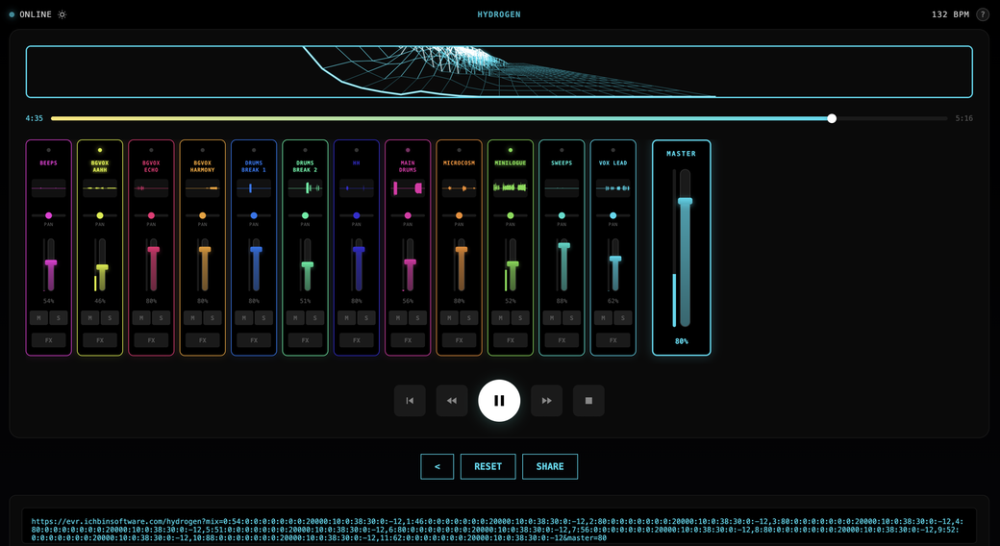
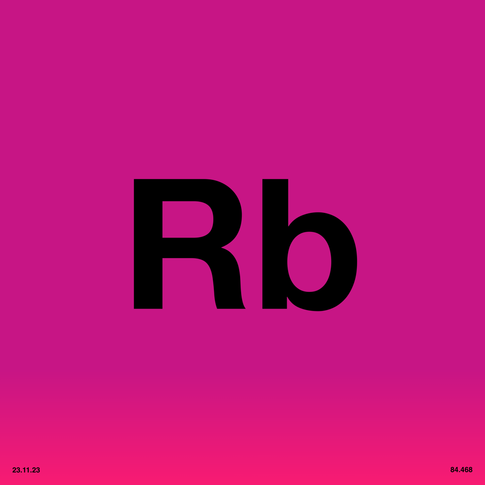
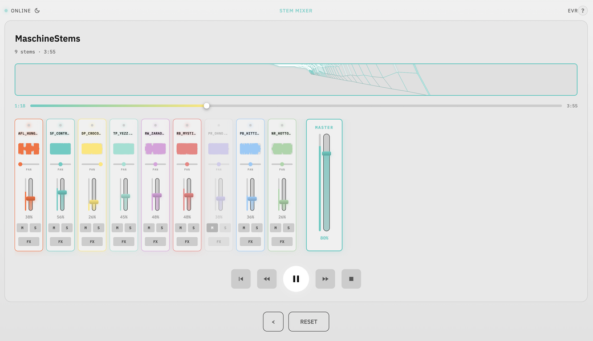

# Everything is Remixed

[](http://creativecommons.org/publicdomain/zero/1.0/)
[](https://mixer.ichbinsoftware.com)


<div align="center">
  
</div>

<br/>

A web-based interactive stem mixer. Remix tracks by manipulating individual audio stems (drums, vocals, synths, etc.) directly in the browser using the Web Audio API.

**Two ways to mix:**

- **[🎛️ Album Mixer](https://evr.ichbinsoftware.com)** — Remix the 7 tracks and 148 stems of [Everything is Free](https://github.com/ichbinsoftware/everythingisfree) by Software-Entwicklungskit
- **[🎚️ Standalone Mixer](https://mixer.ichbinsoftware.com)** — Add and mix your own audio files

All stems, artwork, and code are **public domain** (CC0 1.0).

> *"The mixer is not a playback device. It's a creative tool."*


## ✨ Features

- **Real-time mixing** — Volume, pan, mute, solo per stem
- **Effects chain** — 3-band EQ, highpass/lowpass filter, reverb, delay
- **Shareable URLs** — Every mix state encoded in the URL
- **3D visualizer** — Holographic frequency display
- **Responsive** — Desktop and mobile support
- **Themes** — Light and dark mode


## 🎛️ Album Mixer

### 🏗️ Architecture 

```
┌─────────────────────────────────────────────────────────────────┐
│                        Cloudflare Edge                          │
├─────────────────────────────────────────────────────────────────┤
│  Workers        │  R2 Buckets (per track)  │  Workers Assets    │
│  (routing)      │  hydrogen-stems/         │  (JS/CSS/JSON)     │
│                 │  lithium-stems/          │                    │
│                 │  sodium-stems/           │                    │
│                 │  ...                     │                    │
└─────────────────────────────────────────────────────────────────┘
                              │
                              ▼
┌─────────────────────────────────────────────────────────────────┐
│                         Browser                                  │
├─────────────────────────────────────────────────────────────────┤
│  Web Audio API          │  Canvas/OffscreenCanvas  │  ES6       │
│  (mixing, effects)      │  (waveforms, visualizer) │  Modules   │
└─────────────────────────────────────────────────────────────────┘
```

### 🔊 Audio Signal Chain

Each stem passes through a complete effects chain before reaching the master output:

```
┌──────────┐   ┌─────────┐   ┌──────────┐   ┌───────┐   ┌────────┐   ┌──────┐
│  Source  │ → │   EQ    │ → │  Filter  │ → │ Delay │ → │ Panner │ → │ Gain │
│ (M4A)    │   │ (3-band)│   │ (LP/HP)  │   │       │   │        │   │      │
└──────────┘   └─────────┘   └──────────┘   └───────┘   └────────┘   └──────┘
                                                                          │
                              ┌─────────────────────────────────────────────┘
                              │
                              ▼
                        ┌───────────┐   ┌─────────────┐   ┌─────────────┐
                        │  Master   │ → │   Reverb    │ → │ Destination │
                        │   Gain    │   │ (Convolver) │   │  (Output)   │
                        └───────────┘   └─────────────┘   └─────────────┘
```

### 🔗 URL State Encoding

Mix states are shareable via URL parameters:

```
?mix=0:80:0:0:0,1:100:1:0:0,2:60:0:1:5&master=75
      │  │  │ │ │
      │  │  │ │ └─ pan (-10 to 10)
      │  │  │ └─── solo (0/1)
      │  │  └───── mute (0/1)
      │  └──────── volume (0-100)
      └─────────── stem index
```

## 🎵 Tracks

7 tracks, 148 stems total. Named after alkali metals.

| # | Track | Symbol | BPM | Key | Stems | Link |
|:--|:------|:------:|:---:|:---:|:-----:|:-----|
| 1 | Hydrogen |  | 132 | D Major | 12 | [Mix →](https://evr.ichbinsoftware.com/hydrogen) |
| 2 | Lithium |  | 124 | G minor | 38 | [Mix →](https://evr.ichbinsoftware.com/lithium) |
| 3 | Sodium |  | 140 | G minor | 28 | [Mix →](https://evr.ichbinsoftware.com/sodium) |
| 4 | Potassium |  | 90 | C Major | 19 | [Mix →](https://evr.ichbinsoftware.com/potassium) |
| 5 | Rubidium |  | 132 | G Major | 9 | [Mix →](https://evr.ichbinsoftware.com/rubidium) |
| 6 | Caesium |  | 130 | C Major | 16 | [Mix →](https://evr.ichbinsoftware.com/caesium) |
| 7 | Francium |  | 128 | B♭ Major | 26 | [Mix →](https://evr.ichbinsoftware.com/francium) |


## 🎚️ Standalone Mixer

<div align="center">
  
</div>

<br/>

**[mixer.ichbinsoftware.com](https://mixer.ichbinsoftware.com)**

A self-contained mixer for your own audio files. No server required — runs entirely in the browser.

- Drop or add any audio files (M4A, MP3, MP4, WAV, FLAC, OGG)
- Same effects chain and visualizer as the album mixer
- Works offline once loaded


## 🎨 Artwork

Digital artwork by **Maubere**.


## 📚 Documentation

Technical documentation in [`docs/`](docs/):

| Document | Description |
|:---------|:------------|
| [ARCHITECTURE.md](docs/ARCHITECTURE.md) | System design, modules, signal chain |
| [CLIENT_APP.md](docs/CLIENT_APP.md) | Audio engine, state management, UI |
| [SERVER_WORKER.md](docs/SERVER_WORKER.md) | Cloudflare Workers, R2, routing |
| [MIXER_SYSTEM.md](docs/MIXER_SYSTEM.md) | Effects reference, URL encoding |
| [PERFORMANCE.md](docs/PERFORMANCE.md) | Optimizations, animation loop |

## 🤝 Contributing

Contributions welcome.

1. Fork the repository
2. Create a feature branch (`git checkout -b feature/name`)
3. Commit changes (`git commit -m 'Add feature'`)
4. Push (`git push origin feature/name`)
5. Open a Pull Request


## 👥 Credits

- **Music & Production:** Software-Entwicklungskit · [@ichbinsoftware](https://www.instagram.com/ichbinsoftware/)
- **Artwork:** Maubere


## 📜 Manifesto

### Stems as Invitation

When an artist releases stems, they're saying: this is not finished. This is starting material.

The "final" mix is just one arrangement. The stems contain infinite others. Releasing them is an invitation to find those arrangements.

### The Remix as Artifact

A fan remix is not a cover. It's not karaoke. It's not a lesser version of the original.

It's a new work made from shared material. It has its own intentions. Its own decisions. Its own validity.

The person who mutes the vocals and loops the bridge has created something. The person who solos the drums and studies the pattern has learned something. Both are legitimate uses.

### Copyright as Barrier

Traditional music release is one-directional. Artist to listener. Master recording to passive consumption.

Copyright enforces this direction. The listener cannot legally extract, modify, redistribute. The recording is final. The relationship is fixed.

**This serves commerce. It does not serve culture.**

### CC0 as Bridge

Public domain dedication removes the barrier. The listener becomes a collaborator. The relationship becomes bidirectional.

You can:
- Download the stems
- Remix them
- Release your remix
- Sell your remix
- Never credit the original

All of this is permitted. All of this was intended.

### From Consumer to Collaborator

The mixer is not a playback device. It's a creative tool.

When you adjust a fader, you're not consuming—you're producing. When you share your mix URL, you're not sharing a link to the song—you're sharing your arrangement of the song.

The distinction matters. Consumers receive. Collaborators contribute.

### The Stems Will Outlast the Mix

The "official" mix is a snapshot. The stems are the source.

Future listeners with different tools, different tastes, different contexts will make different mixes. The stems enable this. The original mix does not.

Releasing stems is releasing the future versions of the song, not just the present one.

### Why This Approach

Stems expose the construction. They reveal the tricks. They make the magic legible.

It's dangerous for industries built on scarcity. It's unusual for cultures that equate ownership with value.

But the music was always made of parts. The stems just make that visible.

> *Music should circulate like electricity.*


## ⚖️ License

**CC0 1.0 Universal** — Public Domain

You may copy, modify, distribute, remix, and commercialize this work without permission, credit, or restriction.

## 🔗 Related

- [ichbinsoftware/everythingisfree](https://github.com/ichbinsoftware/everythingisfree) — Album stems, artwork, npm package
- [ichbinsoftware/everythingisvisualized](https://github.com/ichbinsoftware/everythingisvisualized) — 3D music visualizer
